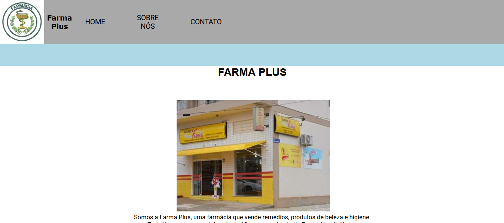
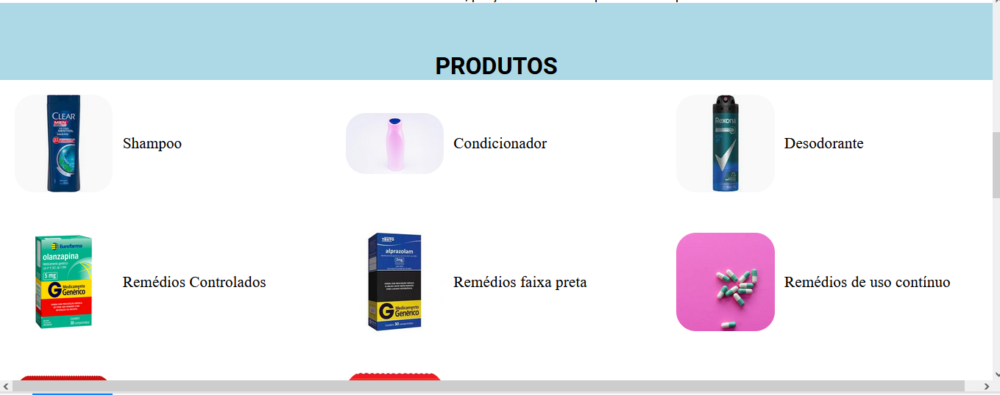
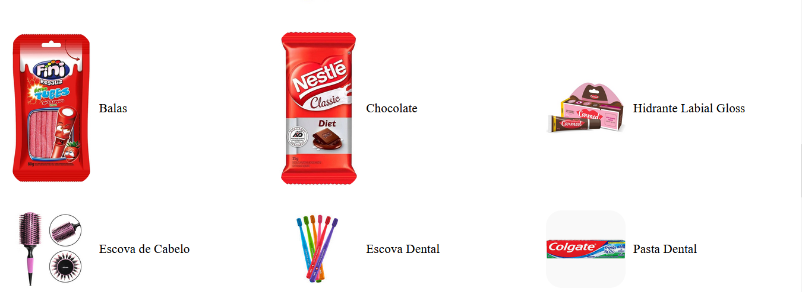
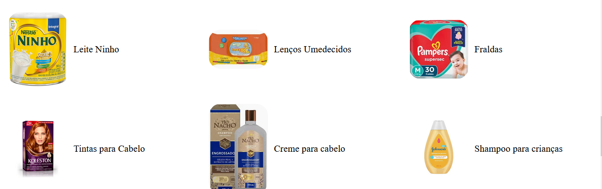
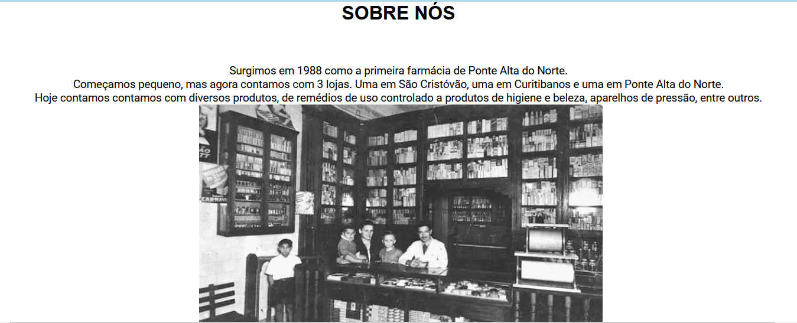
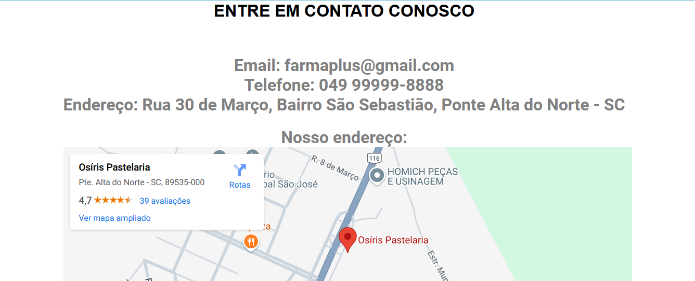
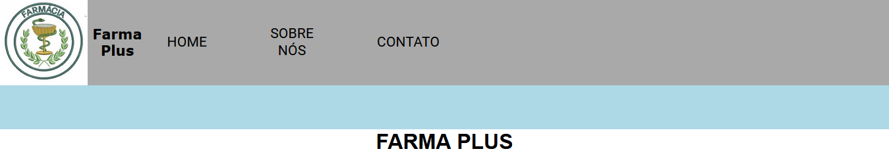

# Farma-Plus

## Sobre

Foi criado um site de divulgação para um farmácia, com o nome fictício Farma Plus, onde o usuário visualiza os produtos existentes da farmácia, uma página com a história da farmácia e uma página para entrar em contato com a empresa. Além da logo do site, um cabeçalho com botões de navegação, e um rodapé.

## Fotos do site pronto

### **Página Inicial**

### **Seção Produtos da Farmácia**

### **Página Sobre Nós**

### **Página Contato**

### **Menu de Navegação**

### **Rodapé do Site**

## Tecnologias

Utilizamos páginas HTML com folha de estilo em cascata(CSS). Deixamos o site totalmente responsivo, no modelo Mobile First. Também utilizamos um JS para dar funcionalidade ao menu hambúrguer, que é um menu utilizado em celulares, o que faz parte da tecnlogia de responsividade Mobile First 
